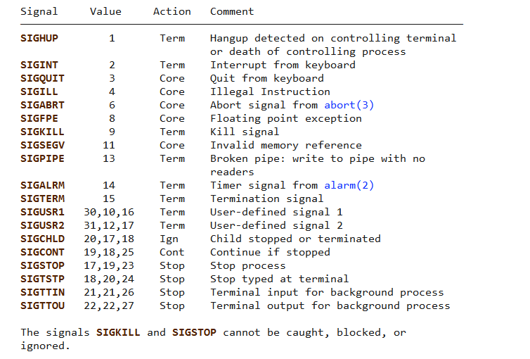

# Process

- see all process

  ```shell
  ps aux | grep whatyouwant
  ```

- see process for port usage

  ```shell
  sudo lsof -i :5432
  ```

## Signals to Processes



[IMAGE LINK](https://i.sstatic.net/9EQBC.png)

- see all process

  ```shell
  sudo kill -l
  ```

- kill process

  ```shell
  sudo kill -9 pid 
  ```